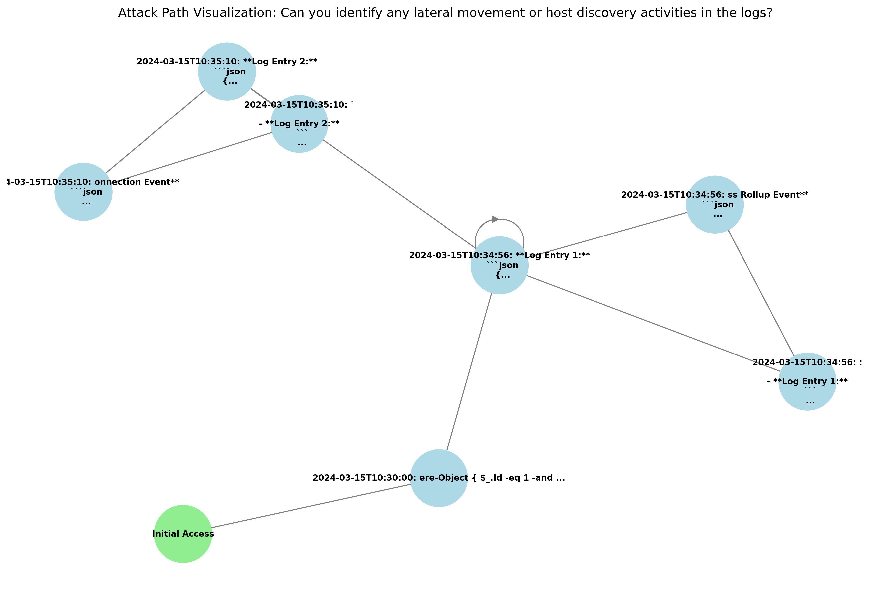

# Security Log Analysis System

A multi-agent system for analyzing Security logs to detect security anomalies using LangGraph and LangChain.

## Overview

This system implements a sophisticated multi-agent workflow for security log analysis:

```
Human Query -> Planner -> [Worker Agents] -> Critique -> Judge -> Actionable Recommendations
```

### Workflow Diagram

#### Call Flow

*Call Flow*


### Key Components

- **Planner**: Analyzes security investigation requests and creates analysis plans
- **Worker Agents**: Parallel specialized security analysts (5 workers) focusing on different MITRE ATT&CK tactics
- **Critique**: Implements voting-based consensus mechanism
- **Judge**: Provides final assessment and actionable remediation steps
- **Visualization**: Generates visual representations of findings

## Features

### Multi-Agent Analysis
- Parallel execution of specialized security workers
- Voting-based consensus mechanism
- MITRE ATT&CK-aligned analysis
- Actionable remediation recommendations

### Visualization Capabilities
- Attack path visualization (directed graph)
- Confidence level distribution (bar chart)
- Specialist contribution analysis (pie chart)
- Timeline-based event analysis

### Demo Scenarios
- Lateral Movement Detection
- Credential Theft Analysis
- Data Exfiltration Detection
- Custom Analysis Support

## Installation

This project uses Poetry for dependency management. To install:

```bash
# Install Poetry if you haven't already
curl -sSL https://install.python-poetry.org | python3 -

# Clone the repository
git clone <repository-url>
cd <repository-name>

# Install dependencies
poetry install
```

## Environment Setup

1. Create a `.env` file in the project root:
```bash
OPENAI_API_KEY=your_api_key_here
```

2. Ensure you have Python 3.12 or later installed

## Usage

### Running the Demo

The easiest way to try the system is through the demo script:

```bash
# Run with interactive scenario selection
poetry run python demo.py

# Run a specific scenario
poetry run python demo.py --scenario lateral_movement
poetry run python demo.py --scenario credential_theft
poetry run python demo.py --scenario data_exfiltration

# Run with custom query and log file
poetry run python demo.py --scenario custom
```

### Running Custom Analysis

To analyze your own Security logs:

```bash
poetry run python main.py --query "Your security investigation query" --log-file path/to/your/logs.json
```

### Visualization Output

The system generates three types of visualizations in the `output/` directory:

1. `attack_graph.png`: Shows the attack path and sequence of events
2. `confidence_levels.png`: Displays distribution of findings by confidence level
3. `specialist_contributions.png`: Shows relative contributions of each specialist

## Project Structure

```
crowdstrike_anomaly_detector/
├── agents/
│   ├── planner.py          # Query analysis and task planning
│   ├── worker_factory.py   # Dynamic worker creation
│   ├── critique.py         # Voting-based consensus
│   └── judge.py           # Final assessment
├── utils/
│   ├── log_parser.py      # Falcon log parsing
│   └── visualization.py   # Visualization utilities
├── demo.py                # Demonstration script
├── main.py               # Main entry point
├── pyproject.toml        # Poetry dependencies
└── README.md            # This file
```

## Dependencies

Key dependencies managed by Poetry:

- `langchain` and `langchain-openai`: Core LLM framework
- `langgraph`: Multi-agent workflow orchestration
- `matplotlib` and `networkx`: Visualization capabilities
- `python-dotenv`: Environment variable management

See `pyproject.toml` for complete dependency list.


## Sample Output

### Attack Path Visualization

*Attack path visualization showing the sequence of events and their relationships*

### Confidence Level Distribution

*Distribution of findings by confidence level after voting-based consensus*

### Specialist Contributions

*Relative contributions of each specialist to the investigation*

## Worker Specialties

The system employs specialized workers focusing on different MITRE ATT&CK tactics:

1. Initial Access Specialist
2. Execution Specialist
3. Persistence Specialist
4. Privilege Escalation Specialist
5. Defense Evasion Specialist
6. Credential Access Specialist
7. Discovery Specialist
8. Lateral Movement Specialist
9. Collection Specialist
10. Exfiltration Specialist

## Analysis Workflow

1. **Planning Phase**
   - Query analysis
   - Task decomposition
   - Worker role assignment

2. **Analysis Phase**
   - Parallel worker execution
   - Specialized log analysis
   - Evidence collection

3. **Consensus Phase**
   - Voting-based consensus
   - Confidence assessment
   - Finding consolidation

4. **Judgment Phase**
   - Final assessment
   - Attack classification
   - Remediation recommendations

5. **Visualization Phase**
   - Attack path visualization
   - Confidence distribution
   - Specialist contribution analysis

## Contributing

1. Fork the repository
2. Create a feature branch
3. Commit your changes
4. Push to the branch
5. Create a Pull Request

## License

MIT

## Author

Jayasimha Raghavan <mr.jayasimha@gmail.com>
